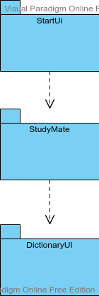

# Arkkitehtuurikuvaus

## Rakenne

- Sovelluksen pakkaus rakenne koostuu käyttöliittymästä joka pitää sisällään 4 eri käyttöliittymän osien pakkaukset.
- Sovellus pitää myös sisällään 5 eri erititeltyjen sovellus logiikkojen pakkaukset.

## Käyttöliittymä

Käyttöliittymä pitää sisällään 8 eri näkymää:
- Kirjautumisnäkymä: [Login](https://github.com/Branuz/ot-harjoitustyo/blob/master/languageApplication/src/main/java/com/poussu/studymate/userInterface/startUI/Login.java)
  - `Kirjautumisnäkymässä` käyttäjä voi kirjautua sisään tai luoda uuden käyttäjätunnuksen.
- Tunnuksenluontinäkymä: [CreateAccount](https://github.com/Branuz/ot-harjoitustyo/blob/master/languageApplication/src/main/java/com/poussu/studymate/userInterface/startUI/CreateAccount.java)
  - `Tunnuksenluontinäkymässä`  käyttäjä voi luoda uuden tunnuksen. 
- Päämenu: [Menu](https://github.com/Branuz/ot-harjoitustyo/blob/master/languageApplication/src/main/java/com/poussu/studymate/userInterface/startUI/Menu.java)
  - `Päämenussa` käyttäjä voi joko siirtyä Dictionary,Word game tai Achievements näkymään sekä kirjautua ulos.
- Dictionary menu näkymä: [DictionaryMenu](https://github.com/Branuz/ot-harjoitustyo/blob/master/languageApplication/src/main/java/com/poussu/studymate/userInterface/dictionaryUI/DictionaryMenu.java)
  - `Dictionary menussa` käyttäjä voi luoda uusia sana listoja, poistaa luomiaan listoja tai valita edit vanhasta listasta.
- Dictionary listaan lisääminen näkymä: [DictionaryAddWord](https://github.com/Branuz/ot-harjoitustyo/blob/master/languageApplication/src/main/java/com/poussu/studymate/userInterface/dictionaryUI/DictionaryAddWord.java)
  - `DictionaryAddWord` käyttäjä voi lisätä uusia sanoja listalle sekä poistaa vanhoja lisäämiään sanoja listasta.
- Word game menu näkymä: [WordGameMenu](https://github.com/Branuz/ot-harjoitustyo/blob/master/languageApplication/src/main/java/com/poussu/studymate/userInterface/wordGameUI/WordGameMenu.java)
  - `Word game menu` käyttäjä voi valita haluamansa listat joiden sanoja hän tulee pelissä harjoittelemaan sekä hän voi käynnistää pelin.
- Word game peli näkymä: [WordGameController](https://github.com/Branuz/ot-harjoitustyo/blob/master/languageApplication/src/main/java/com/poussu/studymate/userInterface/wordGameUI/WordGameController.java)
  - `WordGameController` käyttäjän peli näkymä jossa hän voi harjoitella listojen sisältämien sanojen kääntämistä.
- Achievements näkymä: [AchievementMenu](https://github.com/Branuz/ot-harjoitustyo/blob/master/languageApplication/src/main/java/com/poussu/studymate/userInterface/achievementsUi/AchievementMenu.java)
  - `AchievementMenu` käyttäjä näkee hänen saavuttamansa palkinnot sekä piilossa olevat ja niiden saavuttamis vaatimukset.

So far completed structures of the program

