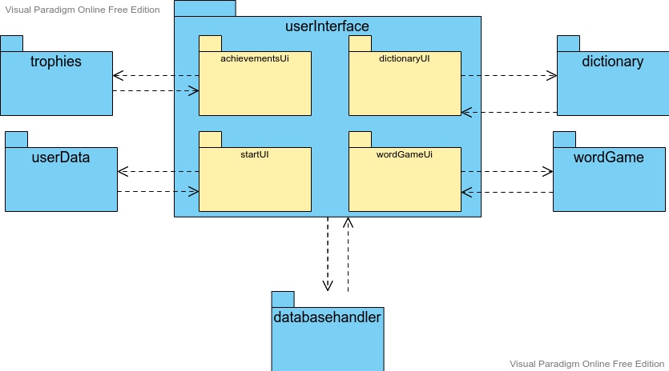

# Arkkitehtuurikuvaus

## Rakenne

- Sovelluksen pakkaus rakenne koostuu käyttöliittymästä joka pitää sisällään 4 eri käyttöliittymän osien pakkaukset.
- Sovellus pitää myös sisällään 5 eri erititeltyjen sovellus logiikkojen pakkaukset.

## Käyttöliittymä

Käyttöliittymä pitää sisällään 8 eri näkymää:
- Kirjautumisnäkymä: [Login](https://github.com/Branuz/ot-harjoitustyo/blob/master/languageApplication/src/main/java/com/poussu/studymate/userInterface/startUI/Login.java)
  - `Kirjautumisnäkymässä` käyttäjä voi kirjautua sisään tai luoda uuden käyttäjätunnuksen.
- Tunnuksenluontinäkymä: [CreateAccount](https://github.com/Branuz/ot-harjoitustyo/blob/master/languageApplication/src/main/java/com/poussu/studymate/userInterface/startUI/CreateAccount.java)
  - `Tunnuksenluontinäkymässä`  käyttäjä voi luoda uuden tunnuksen. 
- Päämenu: [Menu](https://github.com/Branuz/ot-harjoitustyo/blob/master/languageApplication/src/main/java/com/poussu/studymate/userInterface/startUI/Menu.java)
  - `Päämenussa` käyttäjä voi joko siirtyä Dictionary,Word game tai Achievements näkymään sekä kirjautua ulos.
- Dictionary menu näkymä: [DictionaryMenu](https://github.com/Branuz/ot-harjoitustyo/blob/master/languageApplication/src/main/java/com/poussu/studymate/userInterface/dictionaryUI/DictionaryMenu.java)
  - `Dictionary menussa` käyttäjä voi luoda uusia sana listoja, poistaa luomiaan listoja tai valita edit vanhasta listasta.
- Dictionary listaan lisääminen näkymä: [DictionaryAddWord](https://github.com/Branuz/ot-harjoitustyo/blob/master/languageApplication/src/main/java/com/poussu/studymate/userInterface/dictionaryUI/DictionaryAddWord.java)
  - `DictionaryAddWord` käyttäjä voi lisätä uusia sanoja listalle sekä poistaa vanhoja lisäämiään sanoja listasta.
- Word game menu näkymä: [WordGameMenu](https://github.com/Branuz/ot-harjoitustyo/blob/master/languageApplication/src/main/java/com/poussu/studymate/userInterface/wordGameUI/WordGameMenu.java)
  - `Word game menu` käyttäjä voi valita haluamansa listat joiden sanoja hän tulee pelissä harjoittelemaan sekä hän voi käynnistää pelin.
- Word game peli näkymä: [WordGameController](https://github.com/Branuz/ot-harjoitustyo/blob/master/languageApplication/src/main/java/com/poussu/studymate/userInterface/wordGameUI/WordGameController.java)
  - `WordGameController` käyttäjän peli näkymä jossa hän voi harjoitella listojen sisältämien sanojen kääntämistä.
- Achievements näkymä: [AchievementMenu](https://github.com/Branuz/ot-harjoitustyo/blob/master/languageApplication/src/main/java/com/poussu/studymate/userInterface/achievementsUi/AchievementMenu.java)
  - `AchievementMenu` käyttäjä näkee hänen saavuttamansa palkinnot sekä piilossa olevat ja niiden saavuttamis vaatimukset.
## Tietojen pysyväistallennus

### Tietokanta
`databasehandler` paketti pitää sisällään 5 eriteltyä luokkaa jotka kontrolloivat ohjelman eri tietokantaliikenteen toiminnallisuuksia sqlite tietokannan avulla. 
- [ConnectionManager](https://github.com/Branuz/ot-harjoitustyo/blob/master/languageApplication/src/main/java/com/poussu/studymate/databasehandler/ConnectionManager.java)
  - `ConnectionManager` luo yhteyden tietokannan ja ohjelman välillä.
- [DataBaseUpdater](https://github.com/Branuz/ot-harjoitustyo/blob/master/languageApplication/src/main/java/com/poussu/studymate/databasehandler/DatabaseUpdater.java)
  - `DataBaseUpdater` käytetään tietokannan normaalien tietojen ja taulujen päivittämisessä ja lisäämisessä.
- [ListManager](https://github.com/Branuz/ot-harjoitustyo/blob/master/languageApplication/src/main/java/com/poussu/studymate/databasehandler/ListManager.java)
  - `ListManager` hallinnoi uusien sanalistojen luomista ja kokoamista tietokannasta.
- [TrophyManager](https://github.com/Branuz/ot-harjoitustyo/blob/master/languageApplication/src/main/java/com/poussu/studymate/databasehandler/TrophyManager.java)
  - `TrophyManager` hallinnoi käyttäjän saavutusten hakemista ja listaamista tietokannasta.
- [UserManager](https://github.com/Branuz/ot-harjoitustyo/blob/master/languageApplication/src/main/java/com/poussu/studymate/databasehandler/UserManager.java)
  - `UserManager` hallinnoi käyttäjien ja salasanojen olemassaolon tarkistamista ja hakemista tietokannasta.

## Päätoiminnallisuudet

### Uuden käyttäjän luominen ja sisäänkirjautuminen

Kun Login menussa painetaan nappia `Create account` jonka jälkeen kirjaudutaan sisään.

Kun uusi käyttäjä luodaan lisätään se ensin tietokantaan. Tämän jälkeen kirjautumisen yhteydessä ohjelma tarkistaa että kyseinen käyttäjä ja tätä vastaava salasana löytyvät. Jos näin ei ole se palauttaa arvon false ja ohjelmaan kirjautuminen epäonnistuu. Jos kuitenkin tiedot löytyvät niin ohjelma siirtyy main menu näkymään.

### Word Game

Kun Word game menussa painetaan `Start the game` nappia listojen valinnan jälkeen

Kun peli alkaa se luo ensin yhden sekoitetun listan kaikista sanoista jotka olivat valituissa listoissa. Tämän jälkeen ohjelma valitsee tästä uudesta listasta ensimmäisen käännettävän sanan. Jos käyttäjä antaa väärän vastauksen niin ohjelma ilmoittaa siitä tuomalla esiin error labelin. Jos vastaus on oikein käyttäjälle ilmoitetaan tästä jonka jälkeen voidaan siirtyä hakemaan seuraavaa sanaa.
## Rakenteeseen jääneet heikkoudet

Käyttöliittymässä on hiukan koodin toistoa ja muutama pitempi methodi minkä välttäminen on haasteellista.
